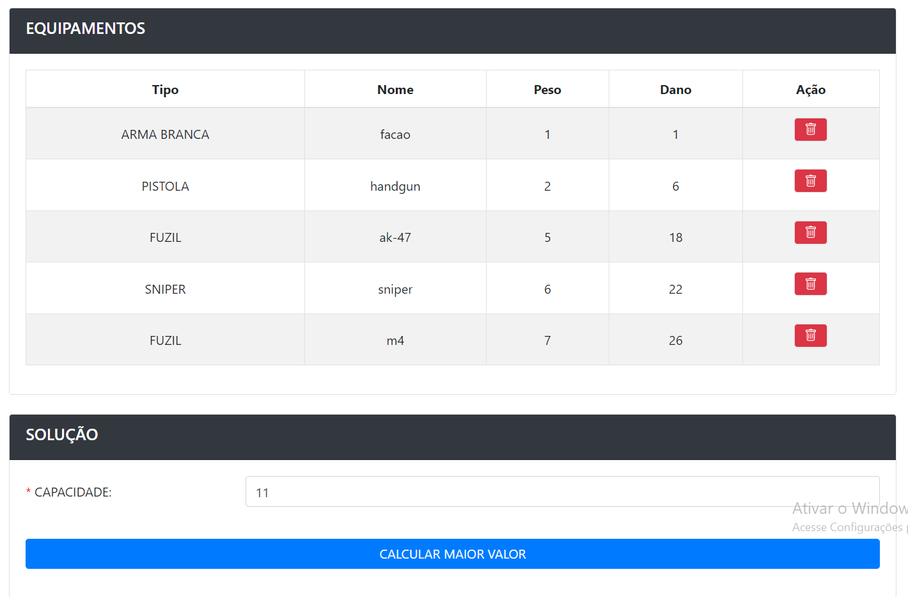
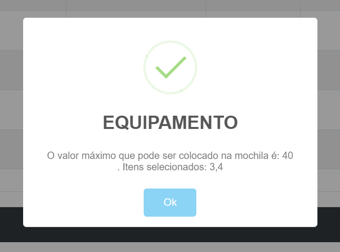

# PD_Gestao_de_projetos

**Número da Lista**: 3 
**Conteúdo da Disciplina**: Programação Dinâmica 

## Aluno
| Matrícula | Aluno          |
|-----------|----------------|
| 19/0134224| Artur Reiman   |

## Sobre 
Este projeto de "Gestão de Equipamentos", inspirada em aplicações para jogos de video game, tem como objetivo principal desenvolver uma aplicação que permita visualizar o melhor conjunto de armas a serem armazenadas numa mochila, contando com seu peso e valor de dano.

## Exemplos de entrada e saída

## Tecnologias 
- HTML: para o desenvolvimento do frontend da aplicação.
- Javascript: para a criação da função do algoritmo.
- CSS: para a estilização do sistema.

Para realizar o uso do projeto basta exercer o dowload e a execução do index.html no browser da sua escolha.

## Gravação 

A fim de facilitar o entendimento completo do nosso projeto foi realizado uma gravação de uso, sendo apresentado no link abaixo:

<iframe width="560" height="315" src="https://www.youtube.com/embed/j2naOSKgt-w?si=5t4SBBta76mNTib5" title="YouTube video player" frameborder="0" allow="accelerometer; autoplay; clipboard-write; encrypted-media; gyroscope; picture-in-picture; web-share" referrerpolicy="strict-origin-when-cross-origin" allowfullscreen></iframe>

